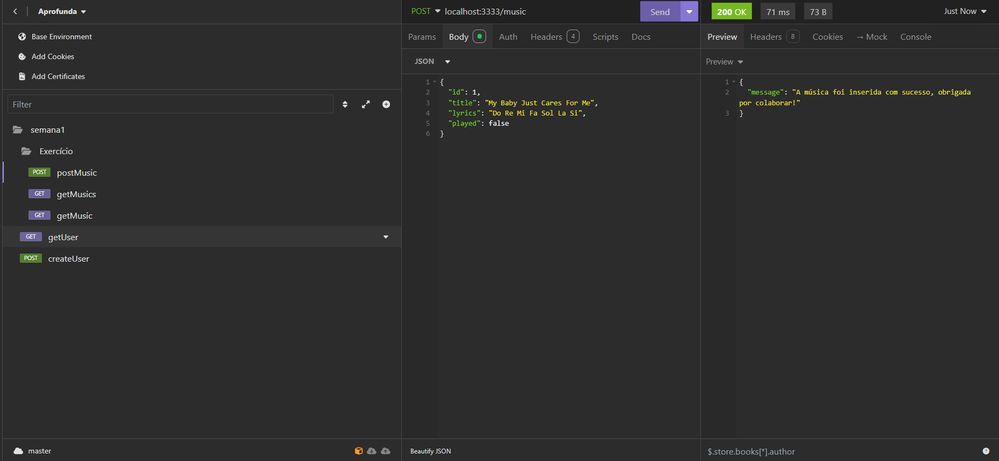

# API Nina Simone

Esta foi uma API criada como Primeiro Exercício do curso Aprofunda PretaLab em um ambiente de execução NodeJS usando o Framework Express para gerenciamento de endpoints e também Nodemon para automação de execução no terminal. Em homenagem à Rainha do Jazz, Nina Simone, esta API fornece músicas dos álbuns *Silk & Soul* e *I Put A Spell On You*.

## 1. Endpoints

| Método   | Rota  |
|--------  |----- |
| GET      | **/music/:id** <p>Retorna a música com o ID indicado da URI e marca ela como reproduzida. </p> <p>**Se existir**: Retorna Status Code 200 e os dados da música no formato JSON descrito no item 1.1</p> <p>**Se não existir**: Retorna Status Code 404 e a mensagem ```Erro: O recurso não foi localizado, verifique se a solicitação está correta e tente novamente```</p>  
| GET    | **/musics** <p>Retorna todas as músicas da API no formato JSON descrito no item 1.2</p>
| POST   | **/music** <p>Permite a inserção de uma nova música na API no formato descrito do item 1.3</p><p>**Se os dados estiverem corretos:** Insere a música na API, retorna Status Code 200 e a mensagem ```A música foi inserida com sucesso, obrigada por colaborar!```</p> <p>**Em caso de dados incorretos/inconsistentes**: Retorna Status Code 400 e a mensagem  ```Erro: a solicitação contém sintaxe diferente da esperada, verifique se a solicitação está correta e tente novamente```</p>

### 1.1 Formato de JSON devolvido pela API no Endpoint GET /music/:id

```
{
    "id": number,
    "title": string,
    "lyrics": string,
    "played": boolean
}
```

### 1.2 Formato de JSON devolvido pela API no Endpoint GET /musics

```
[
    {
        "id": number,
        "title": string,
        "lyrics": string,
        "played": boolean
    },
    {
        "id": number,
        "title": string,
        "lyrics": string,
        "played": boolean
    },
    {
        "id": number,
        "title": string,
        "lyrics": string,
        "played": boolean
    }    
]

```

### 1.3. Formato de JSON aceito no Endpoint POST /music

```
{
    "id": number,
    "title": string,
    "lyrics": string,
    "played": boolean
}  

```


# 2. Testagem de Endpoints no Insomnia

Simulando um uso real da API, a testagem foi conduzida usando o programa Insomnia pensando em um usuário que vai precisar ver todas as músicas disponíveis pra poder escolher a que irá reproduzir. Após a reprodução, a música é marcada como "vista". Também, o usuário pode adicionar novas músicas e vê-las em sua playlist.

## 2.1. Endpoint GET /musics

 

## 2.2. Endpoint GET /music/:id


## 2.3. Endpoint POST /music



## 2.4. GET /musics mostrando a última música adicionada e a primeira como reproduzida


---------

API desenvolvida or *Mariana Amina*. Todos os direitos reservados. 